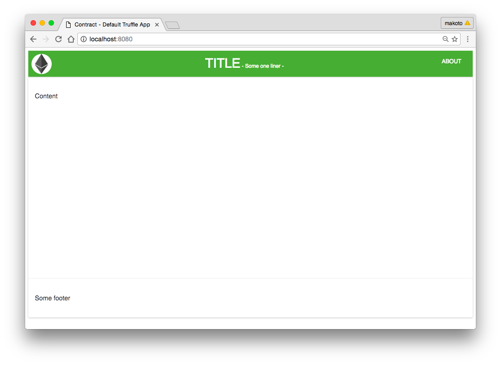

# TITLE: Ms (TBD)


## Prerequisite

- [node.js](https://nodejs.org/en) = v6.3.1
- [npm](http://npmjs.com) = v3.10.3
- [truffle](http://truffle.readthedocs.org) = v 2.0.8
- [testrpc](https://github.com/ethereumjs/testrpc) = v 2.2.4

## setup

- Clone the repo.
- Install npm dependencies

```
npm install
```
- Startup testrpc in one console

```
testrpc
```

- compile, deploy, build and serve the server in another

```
truffle compile
truffle migrate --reset
truffle server
```

- Go to http://localhost:8080/

Then you should see the template like this


